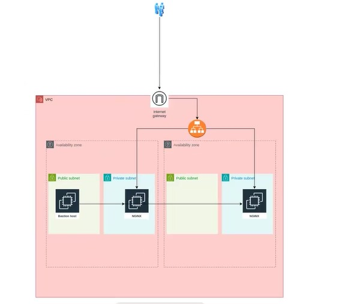

# Terraform Infrastructure Project

## Overview

This project sets up a scalable infrastructure on AWS using Terraform, consisting of a VPC, subnets, EC2 instances, security groups, a load balancer, an Internet Gateway, and a NAT Gateway.
## Desired Infrastructure 


## Getting Started

### Prerequisites

- **AWS account**
- **Terraform installed**
- **AWS credentials configured in ~/.aws/credentials**

## Usage
1. Clone the repository:

    ```bash
    git clone https://github.com/salamaxx97/Terraform_scalabale_using_Modules.git

2. Navigate to the project directory:

    ```bash
    Terraform_scalabale_using_Modules
    ```
3. Update `terraform.tfvars` with your desired configuration values.
4. Initialize Terraform:
   ```bash
   terraform init
5. Plan the deployment:
   ```bash
   terraform plan
   
6. Apply the configuration:
    ```bash
    terraform apply
7.  To destroy the resources:
    ```bash
    terraform destroy


## Project Structure

```plaintext
.
├── ec2.tf
├── network.tf
├── output.tf
├── provider.tf
├── variables.tf
├── terraform.tfvars
├── modules
│   ├── EC2Instances
│   ├── InternetGateway
│   ├── KeyPair
│   ├── LoadBalancer
│   ├── NatGateway
│   ├── Routing
│   ├── SecurityGroup
│   ├── Subnets
│   └── Vpc
└── terraform.tfstate
```

## Modules

### 1. Vpc
- **Description**: Creates the main VPC for the application.
- **Actual AWS Resources Created**:
  - VPC
- **Variables**:
  - `cidr_block`: CIDR block for the VPC.
  - `name:` Name of the VPC.
- **Outputs**:
  - `vpc_id`: The ID of the created VPC.

### 2. Subnets
- **Description**: Provisions public and private subnets in the VPC.
- **Actual AWS Resources Created**:
  - Public Subnets
  - Private Subnets
- **Variables**:
  - `vpc_id`: VPC ID for subnet creation.
  - `subnets`: Map of subnet configurations.
- **Outputs**:
  - `subnet_ids_by_name`: Map of subnet names to their IDs.
  - `public_subnets`: List of IDs of the created public subnets.
  - `private_subnets`: List of IDs of the created private subnets.

### 3. InternetGateway
- **Description**: Creates an Internet Gateway for the VPC.
- **Actual AWS Resources Created**:
  - Internet Gateway
- **Variables**:
  - `vpc_id`: VPC ID to attach the Internet Gateway.
- **Outputs**:
  - `id`: The ID of the created Internet Gateway.

### 4. NatGateway
- **Description**: Creates a NAT Gateway for allowing outbound internet access from private subnets.
- **Actual AWS Resources Created**:
  - NAT Gateway
  - Elastic IP (EIP) associated with the NAT Gateway
- **Variables**:
  - `public_subnet_id`: ID of the public subnet for the NAT Gateway.
- **Outputs**:
  - `id`: The ID of the created NAT Gateway.

### 5. Routing
- **Description**: Manages routing tables and associations for public and private subnets.
- **Actual AWS Resources Created**:
  - Public Route Table
  - Private Route Table
  - Route Table Associations
- **Variables**:
  - `vpc_id`: VPC ID for routing.
  - `public_subnet_ids`: List of public subnet IDs.
  - `private_subnet_ids`: List of private subnet IDs.
  - `internet_gateway_id`: ID of the Internet Gateway.
  - `nat_gateway_id`: ID of the NAT Gateway.
- **Outputs**:
  - `public_route_table_id`: The ID of the public route table.
  - `private_route_table_id`: The ID of the private route table.

### 6. SecurityGroup
- **Description**: Creates security groups for the load balancer, bastion host, and private instances.
- **Actual AWS Resources Created**:
  - Security Group for Load Balancer
  - Security Group for Private Instances
  - Security Group for Bastion Host
- **Variables**:
  - `vpc_id`: VPC ID for security group creation.
  - `name`: Base name for security groups.
- **Outputs**:
  - `load_balancer_sg_id`: ID of the load balancer security group.
  - `private_instance_sg_id`: ID of the private instance security group.
  - `bastion_sg_id`: ID of the bastion host security group.

### 7. KeyPair
- **Description**: Generates an SSH key pair and manages its lifecycle.
- **Actual AWS Resources Created**:
  - EC2 Key Pair
  - Local private Key Saved as `~/.ssh/key_name.pem`
- **Variables**:
  - `key_name`: Name of the key pair to create.
- **Outputs**:
  - `key_name`: Name of the created key pair.

### 8. EC2Instances
- **Description**: Provisions EC2 instances (bastion and private).
- **Actual AWS Resources Created**:
  - Bastion EC2 Instances
  - Private EC2 Instances
- **Variables**:
  - `name`: Name for the instances.
  - `ami`: AMI ID for the instances.
  - `instance_type`: Instance type.
  - `bastion_instance_count`: Number of bastion instances.
  - `private_instance_count`: Number of private instances.
  - `public_subnet_ids`: List of public subnet IDs for bastion instances.
  - `private_subnet_ids`: List of private subnet IDs for private instances.
  - `key_name`: SSH key name for accessing the instances.
  - `security_group_ids`: Map of security group IDs for Bastion and Private Instances.
- **Outputs**:
  - `bastion_instance_ids`: List of IDs of the created bastion instances.
  - `private_instance_ids`: List of IDs of the created private instances.
  - `bastion_instance_public_ip`: Public IPs of the bastion instances.
  - `private_instance_ips`: Private IPs of the private instances.

### 9. LoadBalancer
- **Description**: Provisions an Application Load Balancer and its listeners.
- **Actual AWS Resources Created**:
  - Application Load Balancer
  - Target Group
  - Load Balancer Listener
- **Variables**:
  - `security_group_id`: Security group for the load balancer.
  - `name`: Name of the load balancer.
  - `load_balancer_type`: Type of the load balancer.
  - `internal`: Indicates if the load balancer is internal.
  - `subnet_ids`: List of subnet IDs for the load balancer.
  - `vpc_id`: VPC ID for the load balancer.
  - `instance_ids`: List of instance IDs to attach to the load balancer.
- **Outputs**:
  - `load_balancer_arn`: ARN of the created load balancer.
  - `target_group_arn`: ARN of the created target group.
  - `load_balancer_dns`: DNS name of the load balancer.


## Variables
Variables are defined in `variables.tf` and `terraform.tfvars`. They allow customization of the infrastructure components.

## Outputs
The `output.tf` file defines outputs such as the load balancer DNS name, instance IPs, and key path for SSH access.

## Conclusion
The modular structure and use of variables and outputs in this Terraform project provide flexibility and reusability, enabling easy customization and management of AWS resources.


